# Data Analytics Power BI Report
How does a medium-sized international retailer elevate their business intelligence practices? What actionable insights can be obtained from a large dataset that spans across different regions? 

In this project, we will answer these questions and more through the many applications Power BI has to offer.

## Contents
1. [Project Overview](https://github.com/shhrreeyyaa/data-analytics-power-bi-report406#1-project-overview)
2. [Project Journey](https://github.com/shhrreeyyaa/data-analytics-power-bi-report406#2-project-journey)
3. [Installation Instructions](https://github.com/shhrreeyyaa/data-analytics-power-bi-report406#3-installation-instructions)
4. [Usage Instructions](https://github.com/shhrreeyyaa/data-analytics-power-bi-report406#4-usage-instructions)
5. [File Structure of the Project](https://github.com/shhrreeyyaa/data-analytics-power-bi-report406#5-file-structure-of-the-project)
6. [License Information](https://github.com/shhrreeyyaa/data-analytics-power-bi-report406#6-license-information)

## 1. Project Overview
### Aim
To transform the data into actionable inights for better decision-making.In particular, Power Bi will be used to design a comprehensive Quarterly report for a medium-sized international retailer who is keen on elevating their business inteligence practices.

### How is this Aim Achieved?
Through extracting and transforming data from various origins and designing a robust data model rooted in a a star-based schema, a multi-page report has been created. Within this report, a high-level business summary tailored for C-suite executives has been presented. 

In addition, insights have been provided for their highest value customers, which have been segmented by sales region. These provide a detailed analysis of top-performing products categorised by type against their sales targets, and a visually appealing map visual that spotlights the performabce metrics of their retail outlets across different territories.

### What I've Learned

## 2. Project Journey
### Importing the Data
An essential step for every data analysis project is carefully loading and cleaning data to ensure the most relevant an dinformative analysis. Hence, the beginning of this project involved loading in various tables namely; 'Orders', 'Products', 'Stores' and 'Customers'. The tables were loaded and transformed using various Get Data options including Azure SQL Database, CSV file, Azure Blob Storage and a folder.

To ensure that all the data was relevant and of value, the following key transformations were made:
- Any data that compromised privacy was removed eg [Card Number] was removed from 'Orders' table.
- Distinct columns were created via the Split Column feature to separate date and time data types eg [Order Date] and [Shipping Date] columns were each split into the above 2 data types.
- Duplicates, missing and null values were removed from the necessary columns eg duplicates were removed from [Product Code] in the 'Products' table due to each code being unique.
- Calculated columns were created to convert necessary values so that the units are all the same eg conversion of grams to kg in the 'Products' table.
- Columns were combined to provide more informative information eg [First Name] and [Last Name] columns from 'Customers' table were combined to make [Full Name] column.
- All unused columns in tables were removed along with some being renamed in order to align with Power BI naming conventions.

### Creating a Continuous Date Table 
As the data only records the dates specific to certain events taking place, for example when an order is placed or when the shipping date is, there are many dates that remain missing. These missing dates can result in insufficient and misleading insights, especially when there are periods of this missing data. Creating a continuous data table can help eradicate these issues by filling in the gaps.

I used the CALENDAR function to create the date table. Before I could input the start and end dates, I first used the MIN and MAX functions on the [Order Date] and [Shipping Date] from the 'Orders' table respectively. This gave me the year the first order took place and the year the latest shipping took place, which I then used to input the dates for the start and end of the respective years. 

Next, I added the following columns to the date table; [Day of Week], [Month Number], [Month Name], [Quarter], [Year], [Start of Year], [Start of Quarter], [Start of Month], [Start of Week]. Applying the functions of WEEKDAY, MONTH, QUARTER, YEAR, START OF YEAR, START OF QUARTER, START OF MONTH were all used to achieve this along with nesting some of these functions in others such as FORMAT, which allowed the conversion of the month number into the month name.

The DAX formulas for each column has been shown below:

----------------------------------------------------- Table/list of all DAX formulas ----------------------------------------------------

Finally, in Data view I made sure that the newly constructed date table was marked as a date table, as this informs Power BI of my intention to use this table for time intelligence. This is a particularly important step to ensure optimal performance during calculations and guarantees compatibility with all time intelligence functions.

Thus, the continuous date table was created and completed.

### Building a Star Schema Data Model
Relationships between tables are vital in order to understand insights and create visualisations with the data in the future. A star schema model is one such model that highlights and utilises these relationships and this is the type that I will be utilising for this project.

Firstly, the 'fact' table and 'dimension' tables need to be identified. Typically, the 'fact' table contains quantitative and transactional data, whilst the 'dimension' tables store descriptive attributes. Moreover, each 'dimension' table directly connects to the 'fact' table, which creates a star like diagram as the schema suggests. In this case, our 'Orders' table will be out 'fact' table and all other tables will be 'dimension' tables.

All relationships in the below star schema are one-to-many and of single-filter direction, which the many side connected to the 'Orders' table. 
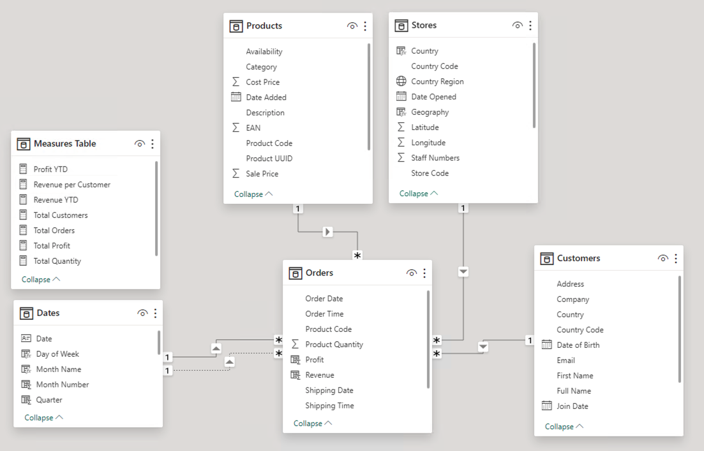

Please note that there are 2 relationships between the 'Orders' table and 'Date' table. The actve relationship between these tables is from the [Order Date] to [Date]. 

### Creating Key Measures
Measures provide mathematical and quantitative insights to the data and can be effective to use in the final report.

The descriptions for each of these measures and their correspondind DAX formula are listed below. In some cases, the construction of a calculated column was required before the final measure could be calculated.

- __Total Orders__: Counts the number of orders from the 'Orders' table.
- __Total Revenue__: Sums the revenue of all the products ordered. Required the calculated column [Revenue] from 'Orders' table.
- __Total Profit__: Sums the profit of all the products ordered. Requires the calculated column [Profit] from 'Orders' table.
- __Total Customers__: Counts the number of unique customers in 'Orders' table.
- __Total Quantity__: Sums the quantity of all ordered items from the 'Orders' table.
- __Profit YTD__: Calculates the total profit for each year using the Total Profit measure.
- __Revenue YTD__: Calculates the total revenue for each year using the Total Revenue measure.

### Creating Hierachies
At first glance, the value of creating hierachies can be easily overlooked. However, to perform granular analysis and drill-through the data, hierachies are an absolute must. Insights from visualisations such as line graphs and bar charts can elevated by simply using hierachies. For this project, there are 2 hierachies namely; Date and Geography.

The Date Hierachy was pretty simple as all the necessary levels had already been created in the continuous date tabel section, so all that was required in this step was to choose the levels and order them. The levels for this hierachy are as follows:
- Start of Year
- Start of Quarter
- Start of Month
- Start of Week
- Date

The Geography Hierachy was slightly more complicated to make as it required new calculated columns in the 'Store' table to be created. In particular, the following columns were created:
- __Country__: Utilises the SWITCH function to convert [Country Code] column to teh full country names.
- __Geography__: Combines both the [Country Region] and [Country] columns into a single column using the logical operator '&'.

Before the final step of creating the hierachy could be done, I first ensured that all the necessary columns were correctly assigned a data category; World region as Continent, Country as Country and Country Region as State or Province. Now all that was left was to create the hierachy:
- World Region
- Country
- Country Region

## Report Pages
1. Executive Summary
2. Customer Detail
3. Product Detail
4. Stores Map
5. Stores Drillthrough

### 1. Executive Summary
The same visualisations used for the 'Customer Detail' report page have been used for this report page. The only new visualisation for this report page was the KPIs, which required new measures to be created.

#### KPIs
KPIs provide an indication of the business performance. In particular, I was interested in the following comparisions:
- Previous Quarterly Revenue vs Target Quarterly Revenue
- Previous Quarterly Profit vs Target Quarterly Profit
- Previous Quarterly Orders vs Target Quarterly Orders

In order to create the visualisations for these KPIs, I needed to calculate the total of each for the previous quarter and the 5% target values. 

Here is the DAX formula that was used for calculating the Quarterly Profit KPI:

__Previous Quarter Profit = CALCULATE([Total Profit], PREVIOUSQUARTER(Dates[Date]))__

__5% Target Profit = [Previous Quarter Profit] * 1.05__

The Quarterly Revenue & Orders KPIs followed the same DAX formulas format and an example of the final KPI outcome is shown below.
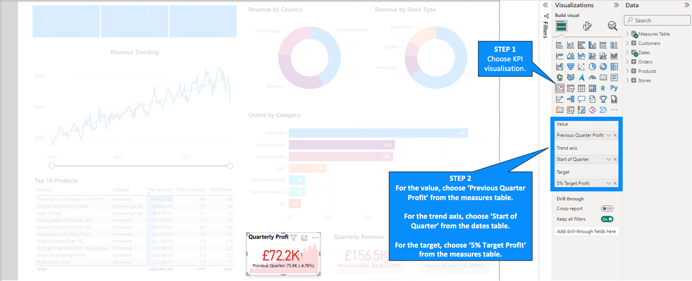

#### Final Result
The final 'Executive Summary' report page:

### 2. Customer Detail
Now that the relevant data has been organised and sorted, it was time to start concising the data into visualisations in the Report View. The first report page I focussed on was the 'Customer Detail' one, which provides information and visualisations on a customer-level analysis.

The following features and visualisations have been used in this report page:
- Cards
- Summary charts through a donut chart and bar chart.
- Line chart
- Table
- Slicer

#### Cards
Cards provide key numerical information and insight from the measures we created prior to creating the report age. There are 2 types of card; a basic card and a multi-row card.
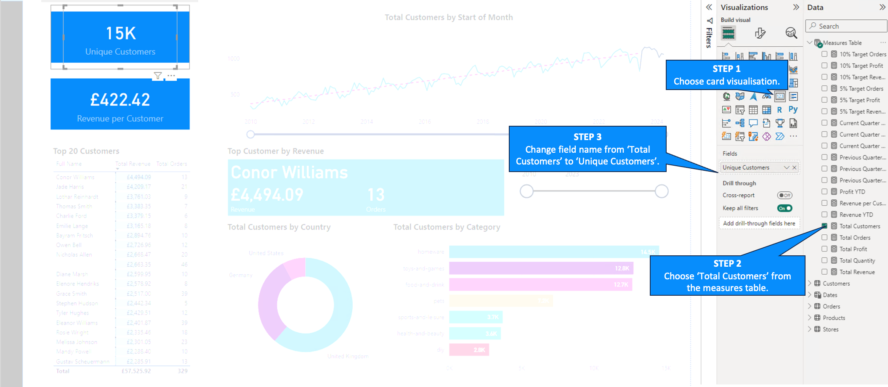
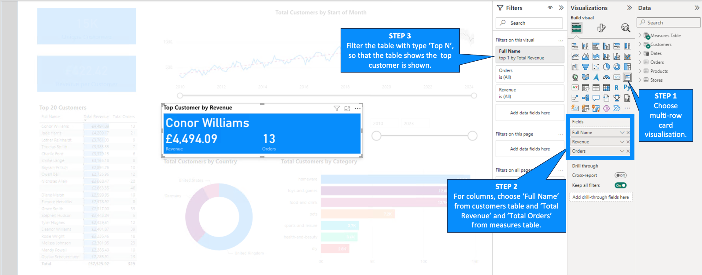

#### Summary Charts
These charts provide an overview of all the data and display information according to a specific categorical value. Donut charts and bar charts can both be used for corss-filtering and cross-highlighting, which allows the users to interact with the report page and gain furter insights.
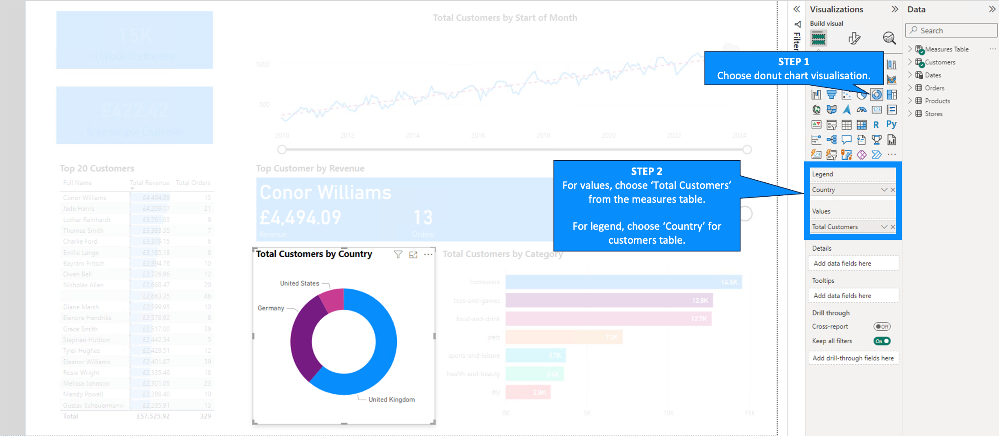
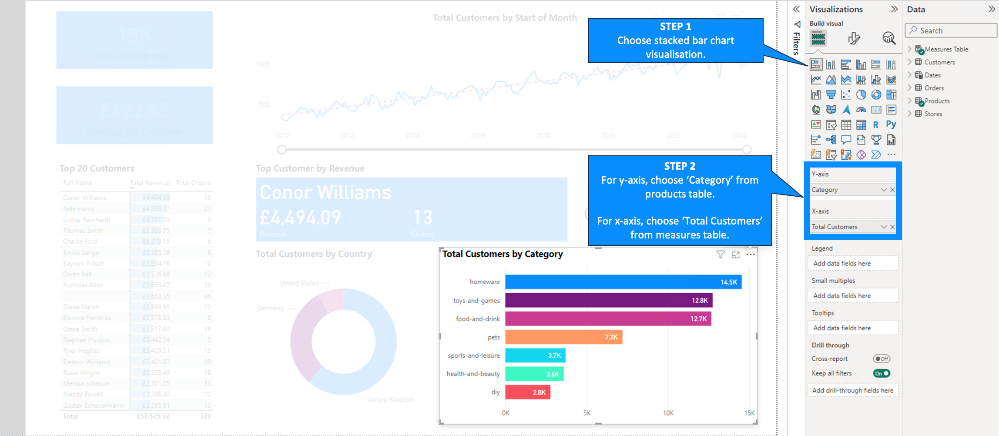

#### Line Chart with Trend Line and Forecast
Line graphs allow us to notice trends and patterns within the data. Two particularly uselful features of this visualisation is the trend line and forecasting. Forecasting creates a visual representation of how the line should look in the next x period, here I have selected a period of 10.
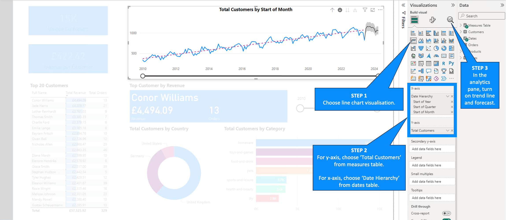

#### Table
It is good to understand the attributes of your top customers, hence I also created a table to display the top 20 customers in the company based on their total revenues.
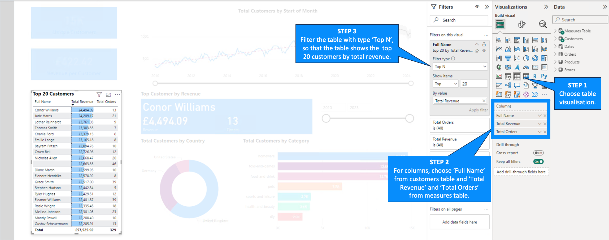

#### Slicer (Vertical List)
Slicers allow you to easily filter a single report page or multiple report page. In this case, the slicer used is a between slicer and is a date slicer concerning the years within the data.
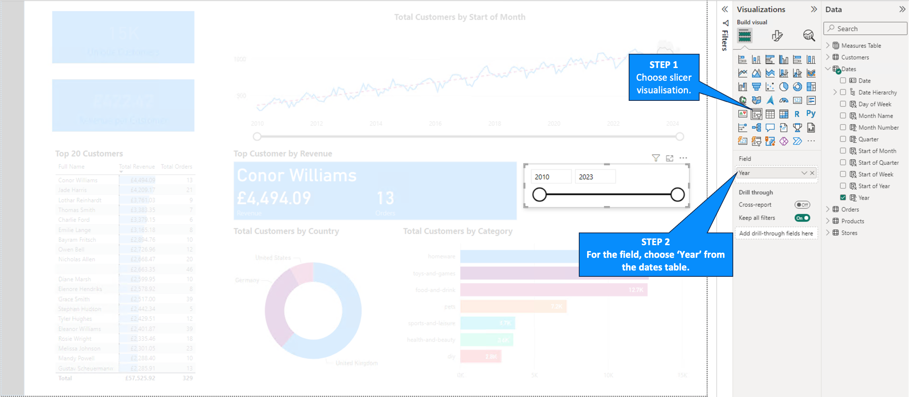

#### Final Result
The final 'Customer Detail' report page:
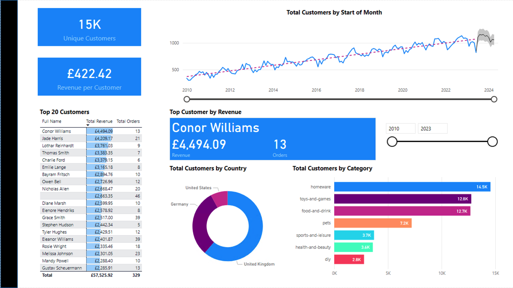

### 3. Product Detail
In this report page, several new visualisations were encountered, which were:
- Area chart
- Scatter graph
- Gauge
- Slicer tool bar

#### Gauge 
- Need to resolve issue for creating this visualisation.

-------------------------------------- Gauge visual instruction screenshots --------------------------------------

#### Area Chart
An area chart allows one to visualise how different product categories perform over time based on revenue.
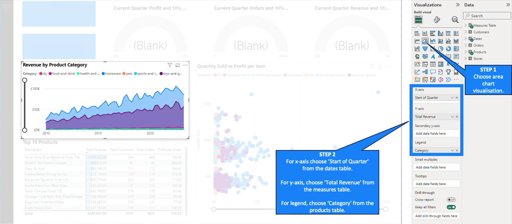
By taking a quick glance at this chart, we can see thatboth homeware and toys-and-games product categories provide the highest revenues, which gradually increase over time.

#### Scatter Graph
This Quantity Sold vs Profit per Item scatter graph provides a visual insight of the product ranges for both top-selling items and most profitable. In order to create this visualisation, I needed to first create a calculated column called [Profit per Item]. The DAX formula used for this was:

__Profit per Item = Products[Sale Price] - Products[Cost Price]__
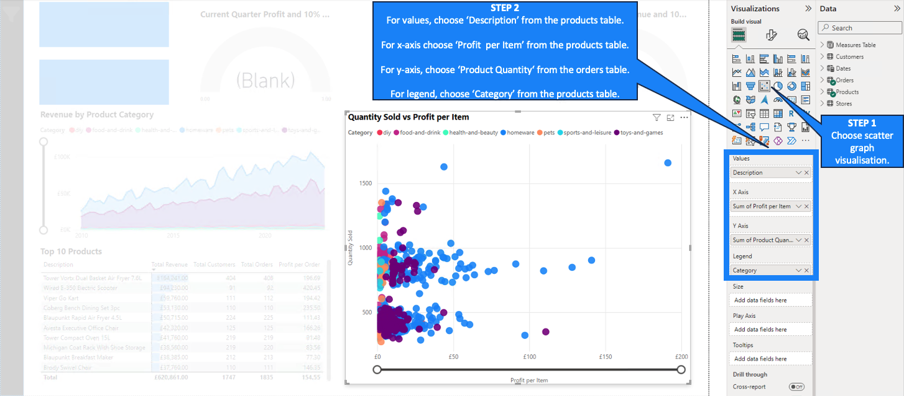

#### Slicer Tool Bar
The slicer tool bar enables users to access multiple filters and apply them, whilst also maximising the view of the report as the slicers can be hidden from view and hence can be used whilst not covering other visualisations. In addition, a slicer tool bar ensures that the report page does no become cluttered and has some level of organisation to it.
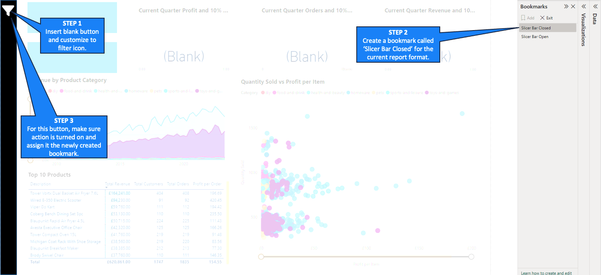
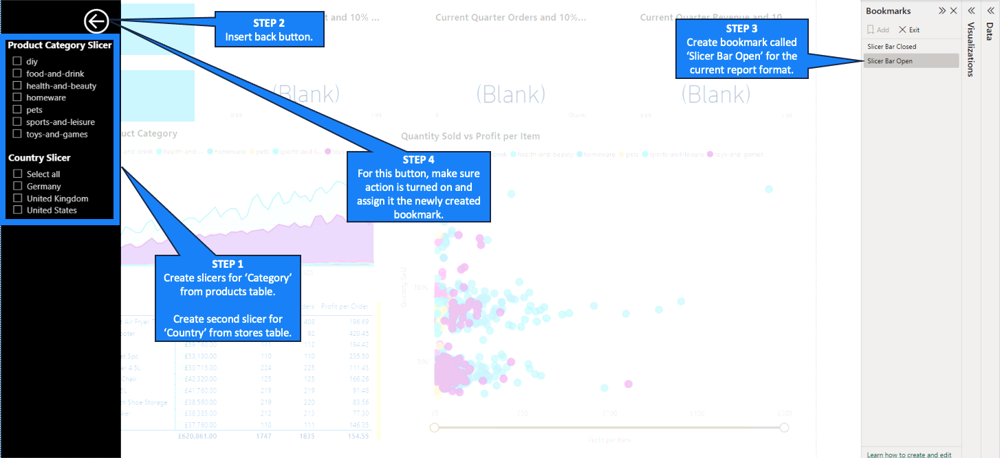

#### Final Result
The final 'Product Detail' report page:

### 4. Stores Map
The 'Stores Map' report page provides a useful insight into the geographical distribution of stores. Key features of this report page are:
- Slicer
- Map
- Informative Tooltip

#### Map
Using a map visualisation is perfect for understanding geographical data. It allows the user to visually see the distribtuion of the stores, along with an indication of their concentration.
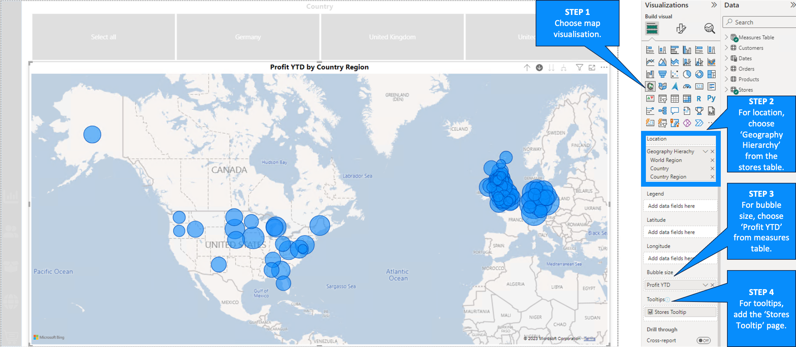

For the location, a hierarchy has been used, which means that the user can drill up and down the map to see 'World Region', 'Country' and 'Country Region'. 

#### Slicer (Tile)
The slicer visualisation allows the map visualisation to change depending on the geographical location selected. This means that the user can cater the visualisation to the geographical locations that are of concern to them.
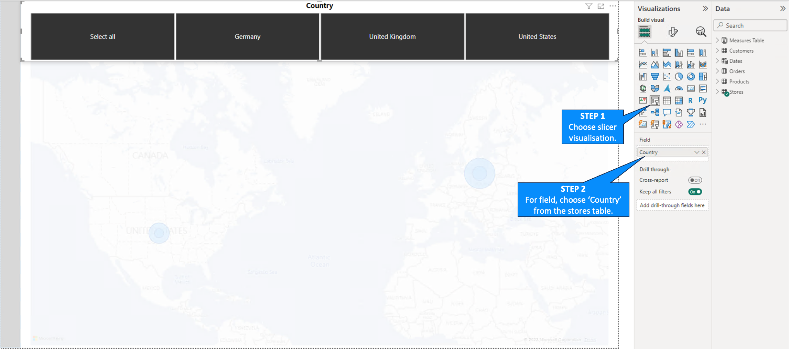
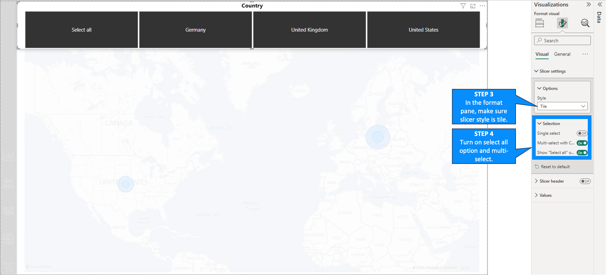

#### Tooltip Page
Unlike the other pages, which are report pages, this page is a tooltip page. This page is created seperate to the 'Stores Map' page, but provides insightful information on the map visualisation .
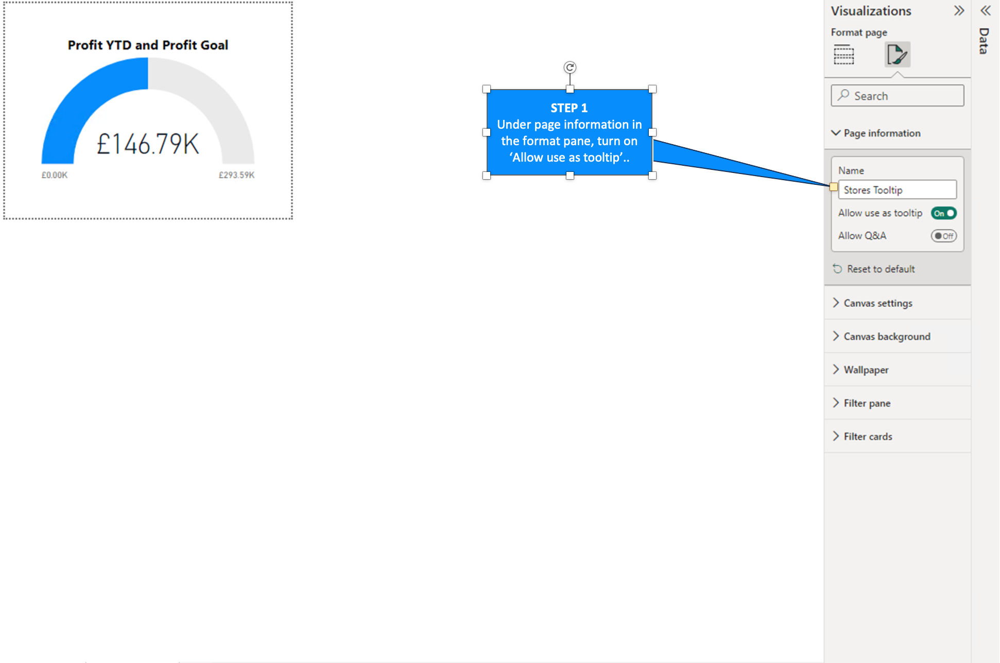
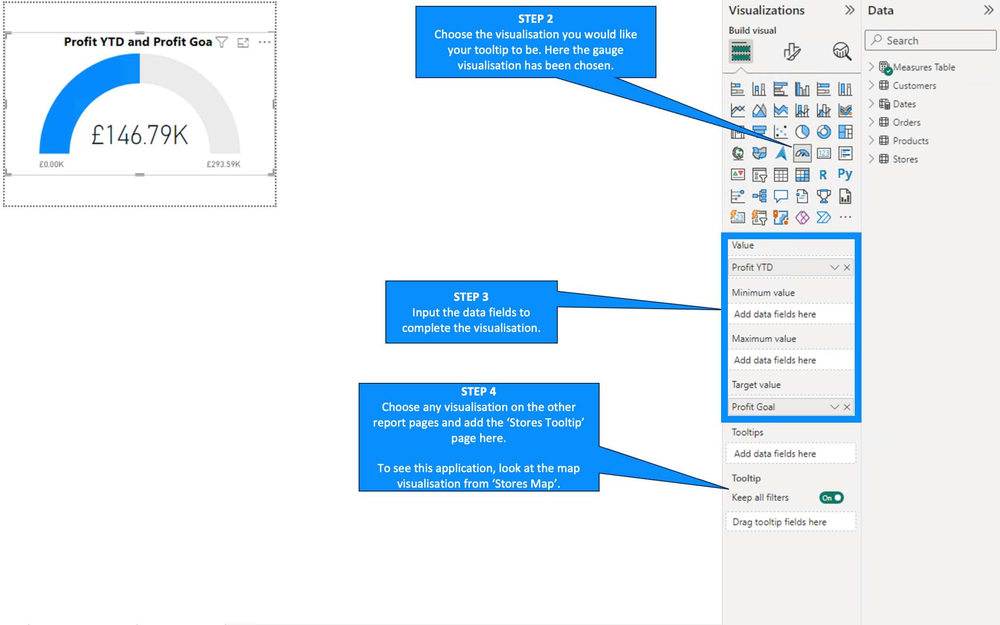

This is case, the tooltip page adds mathematical information to the map visualisation in 'Stores Map' report page. To reveal the tooltip, simply hover over the data of interest in the visualisation in the 'Stores Map' page. 

Here is an example of how the 'Stores Tooltip' page interacts with the map visualisation in the 'Stores Map' page:
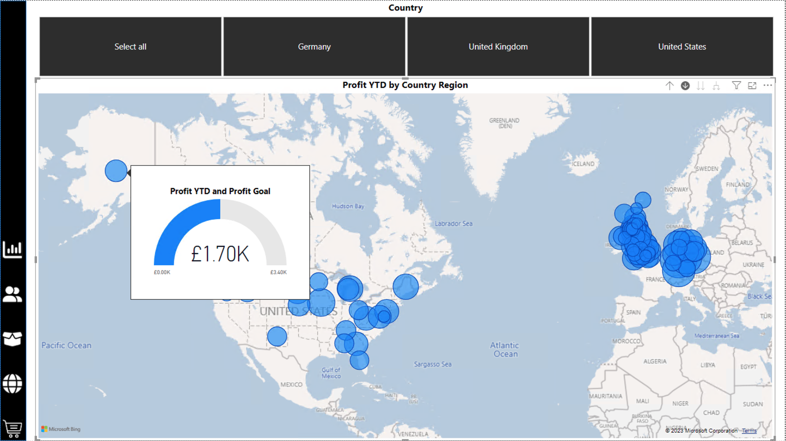

### 5. Stores Drillthrough
This page provides further information on a specific store. There are no new visualisations used in this page.

The final 'Stores Drillthrough' page:
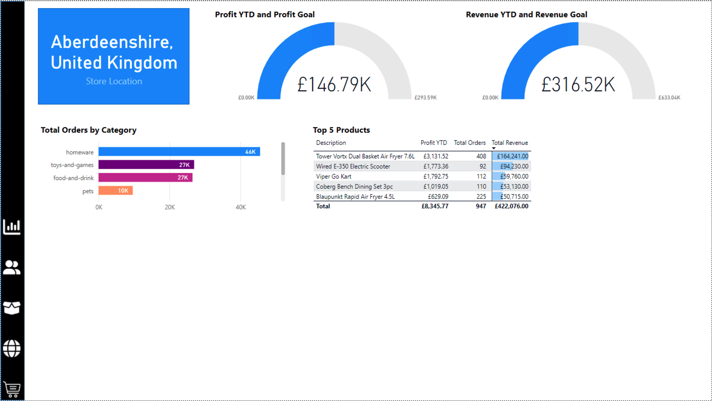

## Cross-filtering and Navigation
Cross-filtering and creating a navigation pane help to bring structure to the overall Power BI report as well as making the pages easier to navigate and analyse.

### Cross-filtering
Cross-filtering is an interaction between visuals on a report page, which causes visuals to chaneg based on filters applied on other visuals. However, sometimes there are visuals where we would not like cross-filtering to occur as to causes more mess and confusion than being a helpful insight. 

To alter the cross-filtering of a visualisation, one needs to got to 'Format' in the ribbon and then to 'Edit Interactions'.

For this project, I needed to alter the cross-filtering for the following report pages:
- Executive Summary
- Customer Detail
- Product Detail

For 'Executive Summary' page, I altered the cross-filtering so that the 'Orders by Category' stacked chart and the 'Top 10 Products' table would not filter the card visuals or KPIs. Moreover, I edited the interactions between visuals so that the 'Top 10 Products' table would not affect any of the other visuals.

In the 'Customer Detail' page, I made sure that the 'Top 20 Customers' table does not filter any of the other visuals. In addition, the interaction between the 'Total Customers by Category' stacked chart and the 'Total Customers' line graph was altered so that the stacked chart does not affect the line graph. Finally, the 'Total Customers by Country' donut chart was edited so that it cross-filters the 'Total Customers by Category' stacked chart.

There was only one visualisation whose interaction was changed in the 'Product Detail' page, which was the 'Quantity Sold vs Profit per Item' scatter graph. This change resulted in ensuring that the scatter graph does not affect any of the other visuals.

### Navigation Bar
The navigation bar allows easy navigation through the report by simply clicking on a button to see a specific report page.

In order from top to buttom, the buttons relate to the following pages:
1. Executive Summary
2. Customer Detail
3. Product Detail
4. Stores Map
5. Stores Drillthrough

## SQL Queries
The Power BI report should give the client more than enough of an insight into their data. However, using SQL to query the data offers an alternative to clients that do not have direct access to Power BI. For this data, created queries for 5 different questions, whose corresponding .sql and .csv files can be found in the 'SQL Queries' folder of this Project.

__Question 1: How many staff are there in all of the UK stores?__
__Question 2: Which month in 2022 had the highest revenue?__
__Question 3: Which German store type had the highest revenue in 2022?__
__Question 4: What are the total sales and total orders for each store type?__
__Question 5: Which product category generated the most profit for the 'Wiltshire, UK' region in 2021?__

## 5. File Structure of the Project
This Power BI Project contains 4 different folders, which will be explained in more detail below, along with the README.md and .gitignore file.

### Power BI Documents
This contains different versions of the Power BI report during this project. The most latest version is the 'AiCore Project.pbix' file.

### Visualisation Instruction Screenshots
This folder contains all the screenshots that have been used throughout this README.md file.

### Table and Column Names
In order to perform the SQL queries in the project, I needed to have a clear list of the table names and the column names in the tables. This folder contains the multiple .csv files, which include this information. 

### SQL Queries
This includes the .sql files for each of the questions and the corresponding .csv files, which contain the results of the queries.